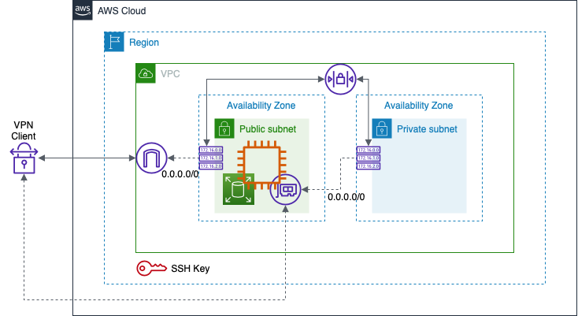

<!-- This should be the location of the title of the repository, normally the short name -->
# yaml-vpnserver-openvpn
# Ansible script to deploy an OpenVPN server on a RHEL system. Example is built using AWS EC2 instance

<!-- Build Status, is a great thing to have at the top of your repository, it shows that you take your CI/CD as first class citizens -->
<!-- [](https://travis-ci.org/jjasghar/ibm-cloud-cli) -->

<!-- Not always needed, but a scope helps the user understand in a short sentance like below, why this repo exists -->
## Scope

The purpose of this repository is to provide example code to demonstrate how a VPN and NAT server can be configured on a RHEL instance. The example is built on an EC2 instance deployed as per the infrastructure depicted in the diagram below. Provisioning of infrastructure is beyond the scope of this example.


<!-- A more detailed Usage or detailed explaination of the repository here -->
## Usage

Update the key variables in vpn-configs.yml file and execute the Ansible playbook as described in (Execution) below.


Key files:

- vpn-configs.yml: User provided variable (see configuration below)
- inventory: Provide the IP address(es) for the EC2 instance(s)
- ansible.cfg: Configure the private key used to access the EC2 instance(s)

Execution:

To deploy the infrastructure components

- `ansible-playbook vpn-server-setup.yml`

To remove the infrastructure, simply delete the EC2 instance using appropriate CLI/provisioning commmands. Alternatively, OpenVPN can be stopped and removed using Linux admin commands on the instance.

Configurations:

The deployment requires the following details:

The following are used primarily when linking this ansible script with a terraform script for provisioning.

- vpc_cidr: Used also in the OpenVPN config to enable routing over VPN
- public_subnet_cidr
- private_subnet_cidr
- aws_region
- hostname
- aws_ssh_key
- aws_security_group
- local_private_key_path

The following are used to configure the OpenVPN configuration. Details are available in vpn-configs.yml and the configuration template in the templates folder. More information can be found on the OpenVPN man pages.

- vpn_config
- route_all_traffic
- dns_server_1
- dns_server_2
- openvpn_port
- openvpn_protocol: tcp #udp
- openvpn_cidr: 10.8.0.0/24
- certificate_prefix

Cleaning up:

No clean up is required post running the script(s).

<!-- License and Authors is optional here, but gives you the ability to highlight who is involed in the project -->
## License & Authors

If you would like to see the detailed LICENSE click [here](LICENSE).

- Author: Sayan A Ghosh <sayan.acharya.ghosh@kyndryl.com>
- Maintainer: Sayan A Ghosh <sayan.acharya.ghosh@kyndryl.com>

```text
Copyright:: 2022-2022 Kyndryl, Inc

Licensed under the Apache License, Version 2.0 (the "License");
you may not use this file except in compliance with the License.
You may obtain a copy of the License at

http://www.apache.org/licenses/LICENSE-2.0

Unless required by applicable law or agreed to in writing, software
distributed under the License is distributed on an "AS IS" BASIS,
WITHOUT WARRANTIES OR CONDITIONS OF ANY KIND, either express or implied.
See the License for the specific language governing permissions and
limitations under the License.
```
